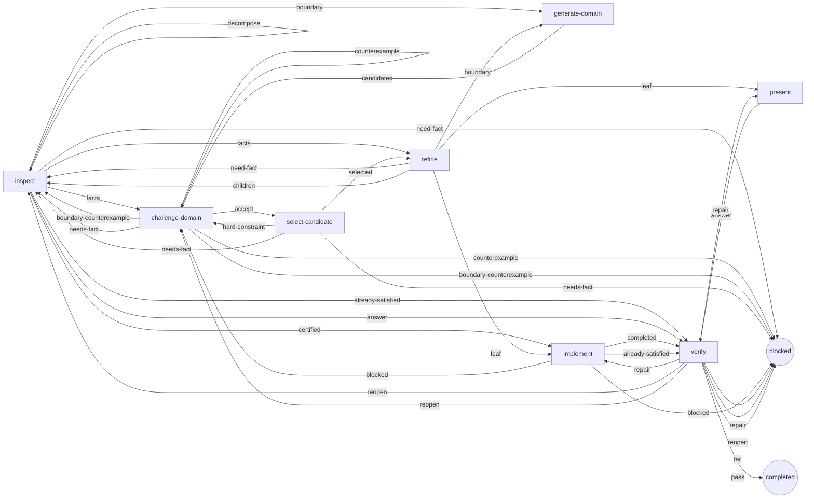

# The `solution-lod` graph

This README describes the currently shipped `solution-lod` LangGraph workflow.
The desired normative behavior lives in [`SPEC.md`](./SPEC.md); this document
records how the current
implementation realizes that contract through topology, state, nodes, edges,
scheduling, and failure semantics.

Source of truth:

| Concern | File |
|---|---|
| Graph builder, nodes, edges, context projection | `graph.ts` |
| Solution network state machines (scheduling, propagation, merges) | `reducer.ts` |
| State and delta types, Zod schemas, role limits | `types.ts` |
| Executable role graph and role contracts | `roles.ts` |

---

## 1. Purpose

The graph turns one authoritative task supplied by its host into a
repository-grounded **answer** or a **verified mutation** by progressively
resolving the solution at the level of detail (LOD) actually required by the
task:

- Small questions collapse quickly to an answer.
- Large changes decompose into a tree of regions, each resolved only as finely as needed. Refinement returns either covering child regions or a certified leaf contract; implementation requires that contract, one selected candidate, and acceptance of the exact current domain fingerprint.

Two structures are deliberately orthogonal:

1. **The solution hierarchy** — a tree of *regions* representing the same problem at conditional levels of detail. Candidate domains are collapsed by WFC-style (Wave Function Collapse) constraint propagation.
2. **The agent activation network** — a sparse message-passing network of *activations*. Each activation is one agent task (`inspect`, `synthesize`, `refine`, `implement`, `verify`, or `present`) that observes a projected slice of state and proposes a typed delta.

Agent routing is not WFC, and hierarchy depth is not automatically a LOD.

---

## 2. Static topology

The compiled LangGraph is a small **engine loop**, not a pipeline of model calls. Only one node ever calls a model.

```text
                        ┌──────────────────────────────────────────┐
                        │                                          │
  START ──► schedule ───┤  result set?  ──► finish ──► END         │
              │         │                                          │
              │         │  singleton implement batch               │
              │         │  and worktree not leased yet? ──► acquire│
              │         │                                          │
              │         │  otherwise: fan out the batch            │
              └─── merge ◄──── activate  (1..width parallel tasks) │
                        ^   │                                      │
                        │   └── Send("activate", task) per entry   │
                        └──────────────────────────────────────────┘
```

Node and edge inventory (from `solutionLodGraph()` in `graph.ts`):

| Node | Kind | Calls a model? | Responsibility |
|---|---|---|---|
| `schedule` | pure controller | never | Propagate the network, create any missing controller-initiated work, pick the next activation batch, or terminate/blocked |
| `acquire` | controller side effect | never | Take the repository lease before an implementation batch (`langgraphAcquireWorktree` from config) |
| `activate` | agent boundary | **yes — the only one** | Call the host runtime once for one activation; produce one `ActivationTaskResult` |
| `merge` | pure controller | never | Deterministically apply the finished batch's records to the network (propagation, supersession, usage accounting) |
| `finish` | pure controller | never | Derive the final result string |

Edges:

```text
START                        → schedule
schedule  (conditional)      → finish | acquire | activate   (see §4)
acquire   (conditional)      → activate                     (always, after re-dispatch)
activate                     → merge
merge                        → schedule                      (unconditional loop back)
finish                       → END
```

The loop `schedule → activate → merge → schedule` repeats until `schedule` sets a terminal `result` (phase `completed` or `blocked`), at which point the next routing goes to `finish`.

### 2.1 Role relationship graph

This is not a fixed pipeline. Each arrow is a controller-observable outcome from the executable `SOLUTION_ROLE_GRAPH` in `src/solution-lod/roles.ts`.

<!-- BEGIN GENERATED SOLUTION ROLE GRAPH -->

<!-- END GENERATED SOLUTION ROLE GRAPH -->

The diagram is topology, not a generic interpreter. Reducer branches choose among an outcome's legal targets from delivery type, evidence state, and bounded-loop state. CEGAR, no-progress, reopen, retry, and semantic-cycle limits can select a declared `blocked` target; those state-dependent explanations remain here rather than becoming extra graph outcomes.

Executable coverage for the declared outcomes and role permissions lives in `test/role-relationship-graph.test.ts`.

---

## 3. State

### 3.1 `SolutionLodState` (graph state, `stateVersion: 11`)

| Field | Type / reducer | Meaning |
|---|---|---|
| `stateVersion` | literal `11` | Checkpoint schema version; runs recorded under older schemas are rejected with a start-fresh message |
| `runId` | string | Run identifier |
| `network.authority` | `SolutionAuthorityFrame` | Exact task and admitted authoritative messages; diagnostic context remains untrusted |
| `directory` / `worktree` | string | Project directory and (leased) worktree path |
| `phase` | string | Human/UI phase label, e.g. `inspect:r3`, `batch:3`, `propagating`, `activation-deferred`, `completed`, `blocked` |
| `activeActivationId` | string \| undefined | Set only when the dispatched batch is a singleton **implement** (used to gate `acquire`) |
| `activeBatch` | `ActiveBatchEntry[]` (replace reducer) | Manifest of the currently dispatched batch: `{activationId, regionId, capability, basisRevision}` per entry |
| `network` | `SolutionNetwork` | The whole solution state (see §3.2); mutated only through reducer functions |
| `results` | `ActivationTaskResult[]` (custom reducer) | Append-only per-task log of the current batch. A task write carries exactly one record keyed by `activationId`; `merge` writes an **empty array**, which atomically clears the log |
| `usage` | `AgentUsage` | Aggregated telemetry (turns, input/output/reasoning/cache tokens, cost) — telemetry and scheduling pressure, never a user-facing budget gate |
| `callsUsed` | number | Count of applied activation records |
| `startedAt` | number | Wall-clock start |
| `result` | string | Terminal result; non-empty `result` is what routes `schedule` to `finish` |

### 3.2 `SolutionNetwork`

A single append-mostly document holding both orthogonal structures plus bookkeeping:

```ts
{
  revision,                       // monotonic; bumped on every semantic change
  nextRegionId, nextEvidenceId, nextConstraintId,
  nextActivationId, nextArtifactId, nextFindingId, nextCertificateId,
  regions:     SolutionRegion[],
  candidates:  SolutionCandidate[],
  constraints: SolutionConstraint[],
  evidence:    SolutionEvidence[],
  activations: Activation[],
  artifacts:   SolutionArtifact[],
  findings:    SolutionFinding[],
  certificates: CompletionCertificate[],
}
```

- **Region** (`r1`, `r2`, …): owns its objective, delivery mode,
  criteria, scope, local decision boundary, domain fingerprints, selected
  candidates, resources, lifecycle status, and separate progress ledgers. A
  normal task starts as root region `r1`; an independently verifiable bundle
  starts as an AND-container with one controller-scoped `partOf` child per
  material task. The current synthesis operation and its basis fingerprint
  belong to the activation, not the region.
- **Candidate** (`r3:switch-parser` style ids): one mutually exclusive solution family within a region; status `possible | eliminated | selected` (interchangeability is derived from `equivalent` constraints, never authored), with elimination reasons, evidence references, and `stances: [{variableId, relation: requires|excludes|prefers, valueLabel}]` positioning the move on shared choices.
- **Shared choice** (`v1`, … / DecisionVariable): `{id, name (globally unique slug), ownerRegionId, seedLabels[]}` — visible only in the owner's subtree; values exist as normalized labels inside stances/bindings, no registry. The primal variable graph (edges from co-occurrence within one move's stances or one constraint) must stay an acyclic forest — enforced at merge via union-find.
- **Constraint**: hard relationship `requires | excludes | equivalent` between candidate endpoints, evidence relationship `supports | refutes` with kind-checked endpoints (`refutes`/`excludes` may also target coordinates `choiceName:option` when backed by ≥1 cited confirmed fact), plus provenance `sourceKind: user-task|repo-evidence|model-inference` and resolved `evidenceRefs`. Model deltas may not claim `user-task`; that source is reserved for trusted controller-authored state. Acceptance criteria and permissions are region policy, not constraint edges.
- **Evidence**: normalized facts deduplicated by a sha256 fingerprint of kind, proposition, source, assertion, and repository location; kind `repository | tool | inference | user`. Repository chunk IDs are activation-local citations mapped directly to controller-issued evidence IDs, while durable semantic references use those evidence IDs. Stored once, passed around by id.
- **Activation** (`a1`, `a2`, …): `{capability, regionId, request, expectedDelta, contextRefs, findingIds?, senderActivationId?, status: queued|running|completed|failed|superseded, basisRevision, sessionId?, error?}`. Repair activations cite exact durable finding IDs.
- **Artifact** (`x1`, …): fingerprinted observed outputs — `file` (with measured content fingerprint), typed `check` (`focused | release | verification`), `answer`, or non-authoritative review detail.
- **Finding** (`f1`, …): criterion-linked defect with `open | repairing | resolved | superseded` lifecycle, a typed `files | answer | environment | external` target, and a controller-derived `local-repair | answer-repair | reopen-decision | blocked-external` route.
- **Completion certificate** (`k1`, …): controller-derived leaf proof containing exact selected-family/equivalence proof, premise, dependency-certificate, artifact, check, resolved-finding, and verifier references plus deterministic dependency and certificate fingerprints.

### 3.3 Initial state

`initial()` in `graph.ts` builds the state from the run input; the network starts as exactly one root region and one queued inspection:

```text
r1 (root, lod 0, unformed, delivery: change)
└── a1: inspect, queued — "Find repository facts needed to distinguish
    the broad solution types…"
```

---

## 4. Node contracts and routing

### 4.1 `schedule` — the controller's decision point

1. **Propagate and create work.** `ensureRunnableWork(network, width)` first runs constraint propagation to a fixed point, then — if nothing is queued — creates the next controller-initiated activation by region lifecycle (see §6): `implement`/`present` for `actionable`, `verify` for `implemented`, `refine` for `unrefined`, `synthesize` for `contradiction`, and for the unresolved frontier (`unformed`/`superposed`) it queues up to `width` `inspect`/`synthesize` activations so read-only work can fan out across siblings. Worktree availability and repository identity are host/runtime responsibilities; runtime startup failures return through the typed activation error contract.
2. **Terminal outcomes.** If every required leaf has a currently valid completion certificate (with collapsed parents covered by those leaves) → `phase: "completed"` with `finalResult(state)`. If no novel delta is possible → `phase: "blocked"` with a precise reason string. Both set `result`, which routes the conditional edge to `finish`.
3. **Select the batch.** `selectActivationBatch(network, width)` orders queued activations by `(basisRevision, numeric id)`:
   - if the head is a **mutating** capability (`implement`, `verify`) → a singleton batch (mutations never run in parallel);
   - otherwise → up to `width` read-only activations (`inspect`, `synthesize`, `refine`, `present`) on **pairwise distinct regions** (`width = 1` reproduces sequential execution; default `width = 3`).
4. **Mark and manifest.** Each selected activation becomes `running`; an `implement` activation also flips its region to `implementing`. The batch manifest is written to `activeBatch`; `activeActivationId` is set only for a singleton implement batch; `phase` becomes `capability:regionId` (singleton) or `batch:N`.

### 4.2 Routing after `schedule`

```ts
state.result ? "finish"
: state.activeActivationId ? "acquire"
: dispatchBatch(state)          // one Send("activate", task) per manifest entry
```

Parallelism uses LangGraph `Send`: each `activate` task receives an `ActivationTaskInput` — a frozen **snapshot** of the state (task, conversation, paths, network) plus the activation — so parallel tasks never race on shared state. Their outputs are reconciled only in `merge`.

### 4.3 `acquire` — worktree lease

Runs before every mutating implementation singleton, including after resume. It invokes the process-local `langgraphAcquireWorktree` hook and does not persist lease ownership in the checkpoint. Routing then proceeds to `activate` via the same dispatch.

### 4.4 `activate` — the only model-calling node

Given one activation task:

1. Rebuilds a task-local `SolutionLodState` from the snapshot.
2. For `implement`, requires `langgraphPrepareImplementationWorkspace`, runs the role in that exact baseline mirror, and measures only the delta produced there. The original worktree is not mutated by the role.
3. Selects the output schema by capability and operation:
   | Capability | Zod schema |
   |---|---|
| `inspect` | `InspectionOutputSchema` |
| `synthesize:generate-domain` | generation schema: every distinct candidate (one only when no materially different alternative exists); no selection or elimination |
| `synthesize:challenge-domain` | challenge schema: exact-fingerprint `accept`, one `counterexample`, one `boundary-counterexample`, or one `needs-fact` |
| `synthesize:select-candidate` | selection schema: compare every viable candidate against the accepted fingerprint |
   | `refine` | `RefinementOutputSchema` |
   | `implement` | `ImplementationOutputSchema` |
   | `verify` | `VerificationOutputSchema` |
   | `present` | `PresentationOutputSchema` |
4. Calls `runtime.call({agent, node: "capability:regionId", state, limits, schema, validateStructured, prompt})` once for the activation, with the capability's role limits as the scheduling quantum and the dependency-projected context (§7) as the prompt. The host decides how to isolate or resume its execution session. `validateStructured` additionally runs controller-side semantic validation before output is accepted. Inspection prompts list the exact projected live hypothesis IDs allowed in `validations`; the controller drops optional validation entries aimed at any other ID and clears meaningless evidence attachments from `unresolved` validations, records each field-local recovery as a validation failure, and still validates the independent evidence, criterion verdicts, and boundary normally.
5. Produces exactly one `ActivationTaskResult`:
   - structured success → `outcome: "applied"` with a `networkDelta` of kind `delta | refinement | implementation | verification | presentation` (implement also records the exact baseline fingerprint and measured delta; a passing change verifier records the host-owned integration result);
   - scheduling-quantum stop (`budgetStop`) → `outcome: "deferred"`; the region stays actionable and the activation can be rescheduled on a new revision;
   - throw (invalid JSON, schema error, timeout) → `outcome: "error"` with the message; **actual isolated-workspace changes are still captured** in `changedFiles` without touching user files.

For a change verifier, `langgraphPrepareVerifierWorkspace` replays only the admitted activation delta onto the run’s latest verified commit (initially clean `HEAD`); replay conflict is an integration dependency, not a reason to reopen semantic discovery. After a pass, `langgraphIntegrateVerifiedWorkspace` creates an independent commit, preserves it under a run ref, and then attempts to merge the same activation delta into the locked user worktree. The region records `pending → landed | conflict` integration state separately from `implemented → verified`. A conflict keeps the completion certificate, selected family, artifacts, commit identity, and tree fingerprint intact while blocking only repository landing. Successful landing updates a network-level latest digest epoch for each changed path, independent of region order or later pruning. A later external digest mismatch invalidates normally and retires that path epoch.

### 4.5 `merge` — deterministic reconciliation

`applyBatchRecords(network, records)`:

1. Orders the finished records by `(basisRevision, activationId)` regardless of completion order.
2. Applies each record with the capability-specific merge (`mergeSolutionDelta`, `mergeRefinementOutput`, `completeImplementation`, `completeVerification`, `completePresentation`), or marks it `failed`.
3. Handles **failed implement** specially: retained isolated-workspace mutations within an unchanged certified scope return to `actionable` with a continuation activation ID. The host copies both the retained working files and their original baseline; the next activation measures the cumulative delta. Three failed implementation attempts block locally. Out-of-scope or superseded-contract mutations remain blocked with artifacts retained.
4. **Supersession:** a record whose region vanished, whose merge throws, or which was computed against an outdated `basisRevision` and whose application lands its region in `contradiction` is rolled back and marked `superseded` — superseded outcomes never consume the retry limit.
5. Runs `propagateNetwork` after every attempted record, including failed and rolled-back records, then one final idempotent pass. Derived contradictions and locks therefore cannot remain stale merely because an activation produced no accepted delta.
6. Accumulates `usage`, increments `callsUsed` by the record count, clears `results` and `activeBatch`, and sets `phase` to `activation-failed` / `activation-deferred` / `propagating`.

Domain propagation also removes dangling references to historical candidates. If
invalidation leaves a challenging or selecting region with no live candidates,
the controller clears stale acceptance and returns to domain generation (or to
inspection when its decision boundary is gone); it never schedules selection
against a null domain fingerprint.

Then the unconditional edge returns to `schedule`.

### 4.6 `finish`

Returns `{result}` — `state.result` if already set, otherwise `finalResult(state)`: answers and changed files are read only from currently valid certificate-backed artifacts, never historical region artifacts. → `END`.

---

## 5. Capabilities and role contracts

All shipped role contracts—default host-facing agent name, system prompt, tool
policy, inherited-model marker, and maximum steps—live in `roles.ts`. A host may
map these bindings to its own runtime. Per-run limits default from
`DEFAULT_SOLUTION_ROLE_LIMITS`:

| Capability | Default agent binding | Tools | Default quantum (turns / context) | Produces |
|---|---|---|---|---|
| `inspect` | `langgraph-inspector` | scoped `graph_discover`/`graph_request_scope`/`graph_search`/`graph_read` only | 32 / 160k | Facts; promotes `unformed → superposed` |
| `synthesize` | `langgraph-synthesizer` | none | 8 / 96k | One bounded operation: generate a domain, challenge it, or select from an accepted domain |
| `refine` | `langgraph-refiner` | none | 8 / 96k | Either exclusively owned covering children or one certified bounded leaf contract |
| `implement` | `langgraph-implementer` | scoped graph reads + edit/write/apply_patch + bash | 32 / 160k | One computed-implementable change region |
| `verify` | `langgraph-verifier` | scoped graph reads + bash (no edit/write/apply_patch) | 16 / 96k | `pass | repair | reopen | fail` verdict with findings mapped to regions |
| `present` | `plan` | none | 4 / 48k | The rendered answer for a read-only region |

Models use the host-resolved `"inherit"` marker by default. Concrete model
selection and per-session overrides are host responsibilities.

---

## 6. Region lifecycle and scheduling policy

`RegionStatus` transitions (driven by controller code in `propagateNetwork`, `ensureRunnableWork`, and the completion reducers — models never set status directly):

```text
                 inspect       generate/challenge/select          refine (split)
  unformed ────────────────► superposed ────────────────► unrefined ────────────────► actionable
     │                          │    ▲                        │                        ││
     │                          │    │ contradiction          │ refine (split)         │implement (lease)
     │                          │    └──────────────┐         ▼                        ▼
     │                          ▼                   │    collapsed (has children)  implementing
     │                     contradiction ◄──────────┘         (children solved)      implemented
     │                          │ synthesize                                          │ verify
     └──────────────────────────┘                                                     ▼
                                                                                   verified
```

Controller scheduling in `ensureRunnableWork` follows this lifecycle with priority: queued work first, then — in order — an `actionable` region gets `implement`/`present`, an `implemented` region gets `verify`, an `unrefined` region gets `refine`, and the unresolved frontier gets inspection or exactly one synthesis operation. Repair work receives exact open finding IDs; successful work moves those findings to `repairing`, and only the subsequent cited verification pass resolves them and creates the leaf certificate. Dependency readiness and terminal audit use certificate validity rather than the `verified` label. Completion premises retain both confirmed evidence and live non-failing artifact references; the audit fingerprints each reference by its actual kind, so an admitted implementation artifact does not invalidate its own certificate. Invalid certificates reconcile only their owning region to the smallest safe frontier. A decision region proceeds `generate-domain → challenge-domain → select-candidate`; acceptance must cite its exact current fingerprint and every viable candidate.

Inspection convergence uses `region.inspectionObligationIds`, initialized from stable criterion IDs, and at most two physical passes per current inspection episode. The breadth pass covers every open obligation; the gap pass covers only unresolved criteria and contradictions. Already-queued focused inspection from challenge, selection, or refinement remains runnable because those controller-admitted transitions can reopen an obligation after the initial episode. Evidence invalidation, changed criteria, conditional-region replacement, explicit prune, and reopen paths can currently reset the episode counter; cumulative telemetry survives those resets. Sixteen inspection activations or twelve recovery events for one region block that region across episodes and prunes; independent regions may continue. The run defaults to 256 physical activations, counted from checkpointed telemetry even if a host resets invocation counters on resume. A run configured below the hard cap may recover a limit-blocked region only when a later configuration permits another pass. `criterionEvidence` closes only named obligations with task or confirmed repository evidence, and fact-only output that closes nothing is rejected. In particular, a criterion-free facts result cannot author inference claims merely to manufacture another inspection pass; the inspector is directed to use gathered observations to return a decision boundary, root decomposition, or mechanically certified terminal result in the same activation. Confirmed evidence that required behavior is absent or incomplete produces an `unsatisfied` verdict; `unknown` is reserved for insufficient or conflicting evidence. Once a scope has controller-owned criteria, an empty optional `region.acceptanceCriteria` projection is a no-op rather than authority to erase that scope. When no obligations remain, inspection compares recorded verdicts for contradictions and returns the boundary; that comparison is not itself a hypothesis or validation target. A challenge or selection fact request must name one criterion ID and reopens only that obligation. A boundary counterexample preserves settled criterion observations and queues an explicit boundary-rebuild inspection with the missing family, defect, and evidence references. It can rebuild from existing confirmed evidence without general reinspection. The rebuild activation is queued at the revised checkpoint basis; regenerated domains retain the two-repair CEGAR count, and focused rebuilds retain cumulative inspection and recovery counts. Independent evidence invalidation still reopens affected criteria.

---

## 7. Context projection

`projectActivationContext(state, activation)` builds the typed semantic projection, and `compileActivationPrompt` renders it as compact role-native sections. The common part contains the original request, relevant conversation, exact local assignment, goal and criteria, confirmed facts, unresolved claims, referenced relationships/outputs, stable `{regionId,candidateId,choice}` lineage entries, and visible `variableStates`. Each variable state carries all binding and unavailability witnesses; conflicting binders are never overwritten into one apparent value. Capability-specific additions:

| Capability | Extra fields |
|---|---|
| `inspect` | `questionToAnswer`, `mustNotChooseSolution` (true when the region delivers a change) |
| `synthesize` | `choiceToMake`, `chooseOnly` (allowed variables), `alternativesAlreadyConsidered` with plain statuses, `ifFactIsMissing` guidance |
| `refine` | `chosenApproach`, `approachToSettle`, numbered `successCriteriaPositions`, one-level child coverage contract |
| `implement` | `chosenApproach`, `ifBlocked` guidance (missing fact vs. wrong choice) |
| `verify` | `chosenApproach`, `changeToCheck` |
| `present` | `answerToWrite` |

Durable facts are stored once in `evidence` and passed by id. Only explicit `contextRefs`, the current candidate slice, visible ancestor-owned variables, and stable selected lineage are projected; unrelated evidence/artifacts and cousin-private variables do not grow the prompt. Inference enters as `hypothesis`. Only an inspector validation backed by independent confirmed repository/tool/user evidence may make it `confirmed` or `rejected`; activation-local repository chunk citations are resolved to their controller-issued evidence IDs during that validation, and model-authored status fields have no authority.

---

## 8. Constraint propagation (WFC-style)

`propagateNetwork` is the fixed-point engine over the candidate domains:

- `refutes`/`excludes` eliminate the target when the subject is active/selected; `requires` selects the target when the subject is selected; `supports` attaches evidence to a candidate; `equivalent` selects both sides of an equivalence class (computed as connected components over `equivalent` constraints) when either is selected.
- A domain with every candidate eliminated → region `contradiction`.
- Exactly one viable candidate → schedule `select-candidate` with basis `only-viable`; collapse remains gated by current domain acceptance.
- Multiple non-equivalent selected candidates → `contradiction` ("multiple incompatible alternatives").
- Shared-choice facts: cited refutations of `choice:option` prune requiring moves everywhere visible; committed selections bind options and prune excluding/requiring-other moves; two live commitments demanding different options surface a contradiction instead of resolving silently. Kills derive on a pure overlay (dead binders release their bindings), then constraint rules evaluate as synchronous fact-stage → commitment-stage sweeps against frozen snapshots.
- After accepted-domain selection: non-equivalent siblings are eliminated, `selectedCandidateIds` stabilize, and the region status becomes `collapsed` (children exist), `actionable` (a certified leaf exists), or `unrefined` — **selection never implies actionability**. Soft preferences rank viable candidates lexicographically but never become elimination witnesses.

`validateSolutionDelta` mirrors the merge so that a delta which would eliminate every candidate with none selected is rejected *at validation time* with guidance and retried; a truly dead region is recovered by reopening the parent, not by an empty domain.

---

## 9. Terminality, refinement, and reopening

Refinement must return exactly one of two forms. Covering children have unique names and collectively cover every parent criterion; multiple children may contribute to one cross-cutting criterion. They start `unformed` with no copied evidence and carry `edge: refines` (a later choice) or `partOf` (an independent deliverable). Before returning a certified leaf, refinement attempts a two-way partition. Parent mutation resources bound authority: children and certified leaves may narrow a directory to descendant paths but cannot escape or widen it. Shared files do not force semantic atomicity; implementation remains serialized. Criteria and requirement coverage, rather than exhaustion of permitted paths, establish complete decomposition. A leaf records every stable criterion and material requirement ID, bounded mutation resources, executable checks, only confirmed evidence references, and an exact atomicity witness explaining why splitting would overlap ownership, require unresolved coordination, or merely wrap the same change. The controller marks the region actionable only when that leaf contract exists, the exact current domain is accepted, and exactly one candidate is selected.

For a multi-task request, the root is an AND-container rather than an OR-domain. Every material root requirement and criterion belongs to exactly one stable child scope. A non-decomposed initial boundary defines its observable root acceptance criteria before binding each material requirement to an exact zero-based criterion position; requirements cannot bind against an empty implicit criterion list. Each child follows normal inspection and, when it contains a decision, the bounded generation/challenge/selection lifecycle before refinement, implementation, and verification. Completion audits scope coverage, dependencies, mutation conflicts, and verification of every live child; blocked children are reported without removing completed siblings. Task decomposition takes precedence over correction certification: explicitly separate dependent deliverables retain their scope identities, and each child may certify its own prescribed correction. A behavior stays with its tests and documentation; these supporting activities do not create separate task scopes. Child inspection requests explicitly permit certification of grounded prescribed corrections; certification authorizes implementation and leaves future tests and documentation as mandatory implementation and verification checks. Unknown current test status alone does not require an inspection loop. Repository-certified corrections can take the focused inspect → implement → verify path, and already-satisfied work can proceed directly from inspection to verification.

Invalidation is surgical: a new synthesis selection drops the previous refinement subtree; a verifier `reopen` does the same for the targeted region and resets its candidates. A verifier `fail` blocks rather than reopening. Unrelated collapsed regions, global evidence, and observed artifacts survive.

---

## 10. Failure semantics

| Situation | Effect |
|---|---|
| Invalid JSON / schema / semantic validation / timeout | Activation marked `failed`; only that activation is lost — solution state remains, another novel activation may run |
| Scheduling quantum stop (`maxTurns`, context, inactivity watchdog) | `deferred`; region stays actionable; the same capability/region/`expectedDelta` signature is re-creatable on a new revision |
| Duplicate proposal (same `capability + regionId + expectedDelta` at the same revision) | Suppressed in `addActivation` |
| Repeating failed work | Capped at `MAX_ACTIVATION_RETRIES = 3` failed attempts per signature |
| Out-of-basis or landing-in-contradiction record | Rolled back and marked `superseded` (does not consume retries) |
| No capability can produce a novel delta | Run ends `blocked` with a precise reason, never a silent loop |
| Implement fails after mutating files | Workspace diff still reconciled and recorded as artifacts; region returns to `actionable` under the same contract for at most three failed implementation attempts; out-of-scope edits block |

---

## 11. Checkpointing and host-managed recovery

- The graph accepts any LangGraph `BaseCheckpointSaver`; the default
  `DurableFileSaver` writes atomic per-thread checkpoints under
  `$OPENCODE_LANGGRAPH_STATE_HOME` or
  `~/.local/state/opencode-langgraph/checkpoints`.
- Every state-bearing controller transition is checkpointable. Compatible
  state can therefore resume after process restart through the host's normal
  LangGraph invocation flow.
- The reducer exports targeted reopening and subtree invalidation operations.
  A host may expose inspect, prune, pause, or resume controls around those
  primitives, but Neolit does not define that host API, run registry, or UI.

---

## 12. Progress, display, and configuration

- `progress(state)` produces the semantic snapshot (`solution-lod-v2`): regions
  with LOD, boundary, viable-domain, progress-ledger, finding, certificate, and
  CEGAR diagnostics plus candidates, constraints, evidence, activations,
  artifacts, telemetry, usage, and phase.
- `display` maps graph nodes to host-neutral phase labels: `schedule → collapse`,
  `acquire → lease`, `activate → activate`, `merge → propagate`, and
  `finish → result`.
- `SolutionLodOptions` includes role-to-agent assignments, role limits,
  `maxParallelActivations` (default `3`), `maxActivations` (default `256`), optional
  `maxInspectionsPerRegion` (which may lower the controller's hard two-pass cap),
  run limits, and a checkpointer. Example:

```ts
const configured = solutionLodGraph({
  agents: {
    inspect: "inspector",
    synthesize: "synthesizer",
    refine: "refiner",
    implement: "implementer",
    verify: "verifier",
    present: "presenter",
  },
  maxParallelActivations: 3,
  maxActivations: 256,
  maxInspectionsPerRegion: 2,
  checkpointer,
});
```

---

## 13. End-to-end walkthrough (mutation path)

```text
1. START → schedule: propagate; root r1 unformed → queue a1 (inspect r1) … dispatch
2. activate (inspect): agent reads the repository → SolutionDelta (evidence)
   merge: facts recorded, r1 → superposed; schedule queues synthesis
3. activate (synthesize:generate-domain): create bounded candidates and constraints
   merge → activate (synthesize:challenge-domain): accept or add one counterexample
   merge → activate (synthesize:select-candidate): compare all viable candidates
   merge: guarded propagation collapses the accepted domain → r1 unrefined; schedule queues refine
4. activate (refine): return a certified leaf implementation contract (or covering children,
   repeating 2–4 one LOD deeper per child)
   merge: r1 → actionable; schedule routes through acquire → worktree leased
5. activate (implement): bounded change under the contract; workspace snapshot diff
   merge: file/check artifacts; r1 → implemented; schedule queues verify
6. activate (verify): pass → r1 verified (repair → actionable; reopen → targeted reopen)
7. schedule: every live region verified → result = summary + changed files → finish → END
```

The read-only path is shorter: an inspector may return an evidenced `resolvedAnswer` while marking the region `delivery: "answer"`; validation requires at least one real fact reference and the merge records an answer artifact. Otherwise a selected answer region is refined to a certified leaf contract, `present` renders from recorded facts, and `verify` checks it before completion.

## Delivery regression gate

The reference host owns the real-model matrix and workspace delivery tests. See
[`opencode-langgraph/scripts/README.md`](../../../opencode-langgraph/scripts/README.md)
for `npm run benchmark:delivery`. The matrix verifies prescribed, design-choice,
multi-file, and dependent tasks with independent executable checks, preserved
commit references, finite limits, and no manual pruning. Kernel regression tests
exercise the compiled graph's retained-edit retry and mutation-epoch behavior.

`telemetry.recoveryEvents` records cumulative invalidation, prune, explicit
reopen, and implementation-retry events with region, revision, and reason. It is
separate from the local `reopens` ledger. `firstVerifiedChangeAt` records the first
applied verification with a landed change; subtract the original run start to
measure time to first verified delivery. Usage and physical-activation totals
accumulate from the network across invocation/resume boundaries.
